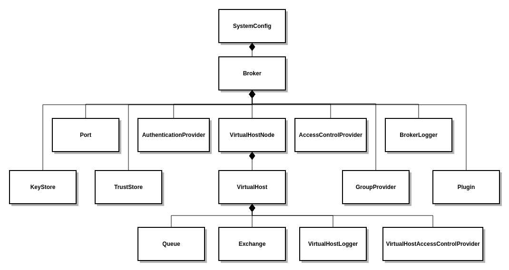
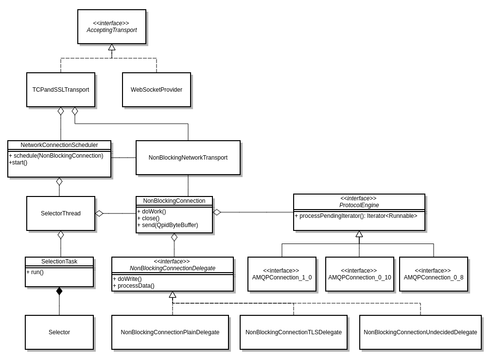
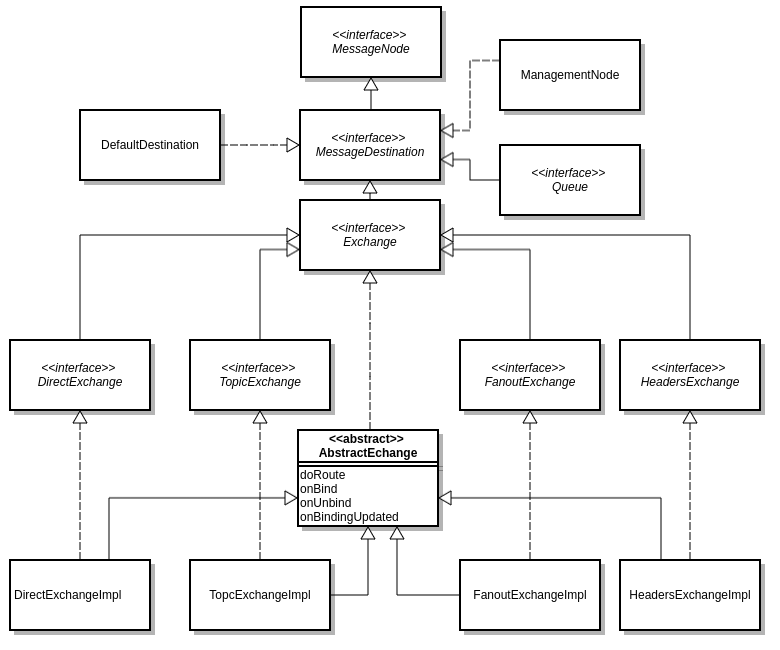
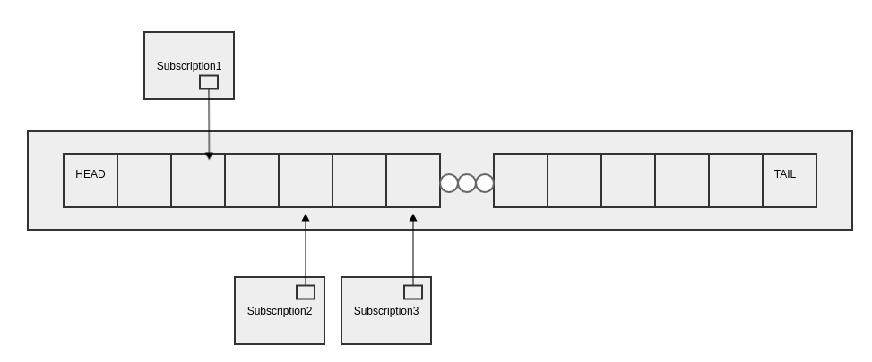
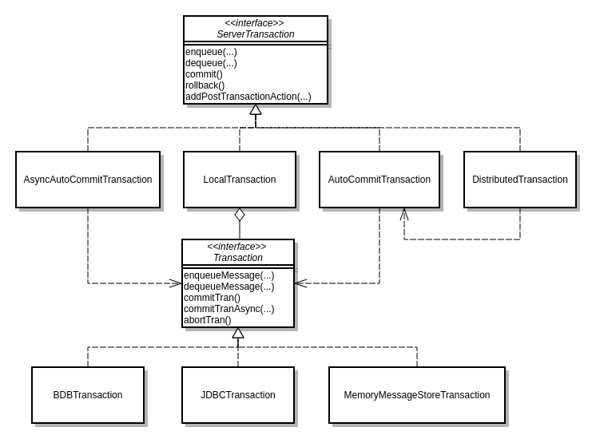
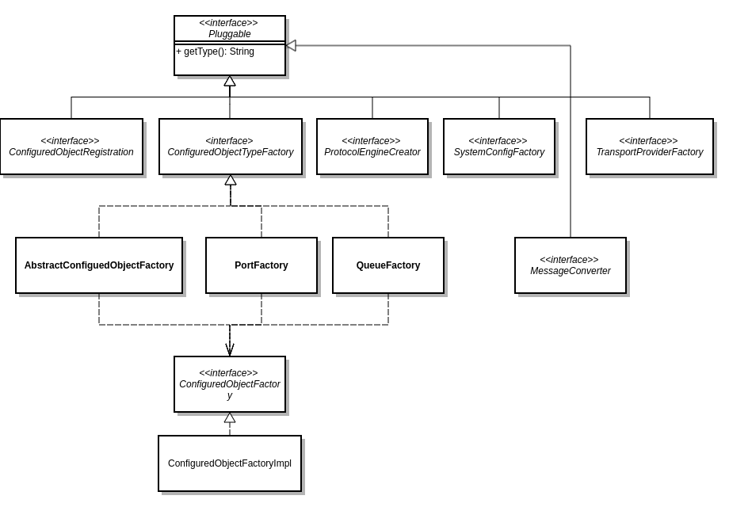
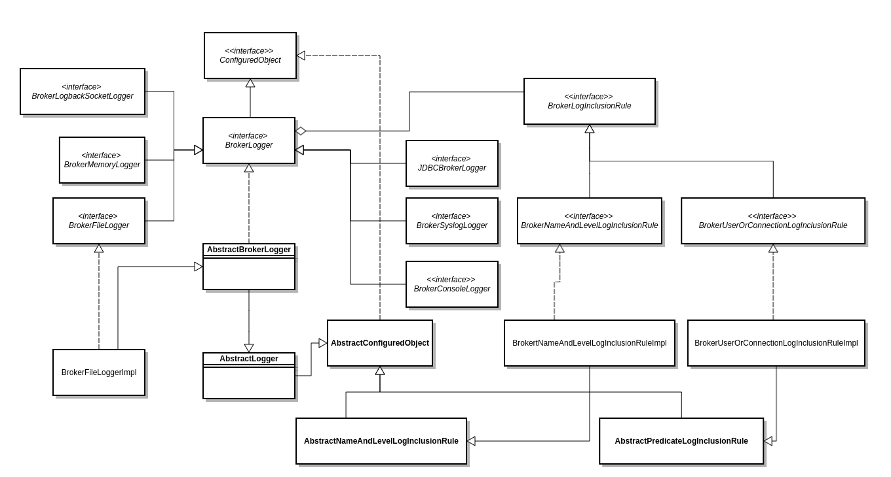
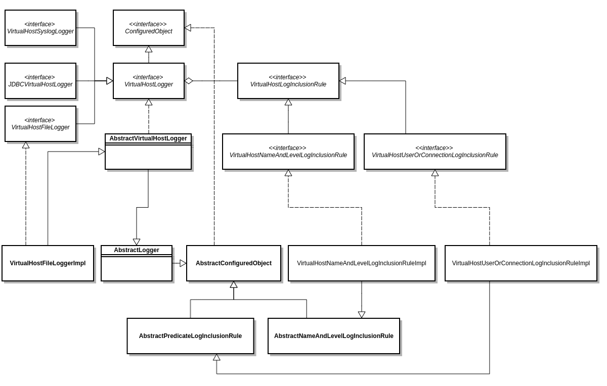
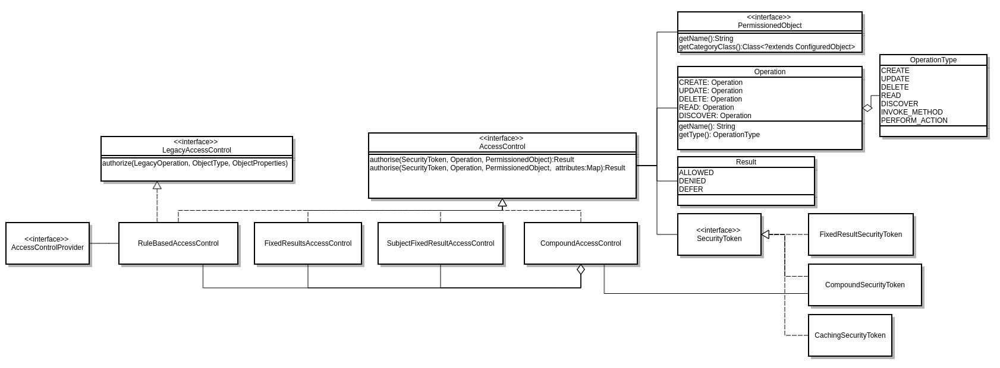
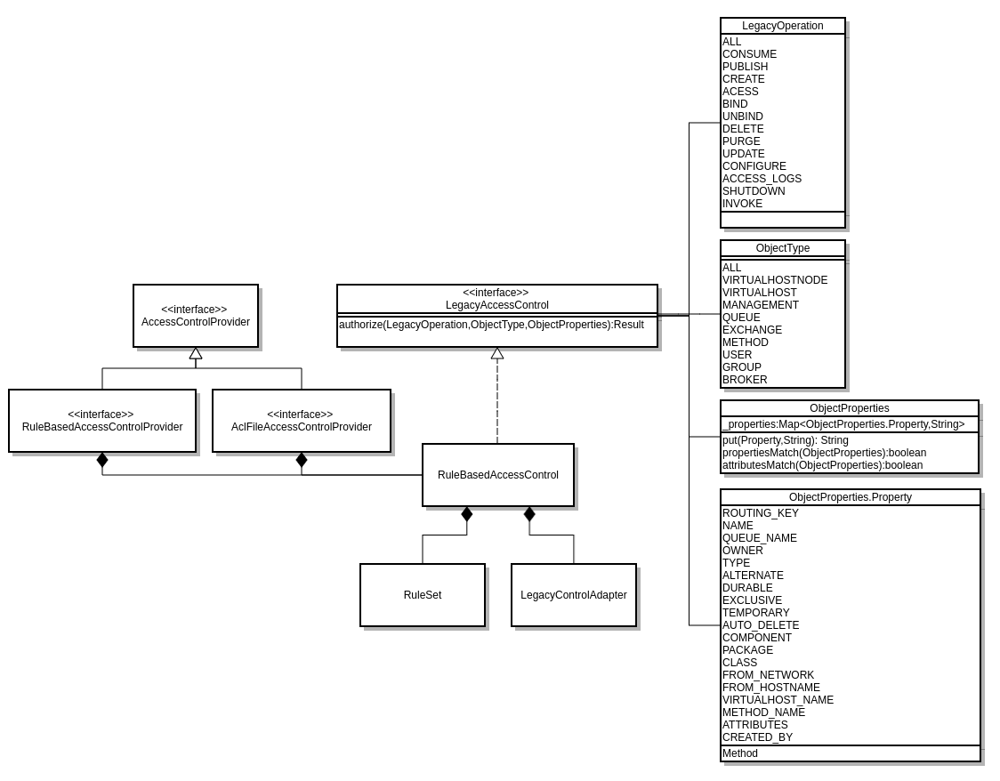

# High Level Architecture

This article provides a high level description of the architecture of Qpid Broker-J.

<!-- toc -->

- [Introduction](#introduction)
- [Model](#model)
- [Category Specializations](#category-specializations)
  * [Attributes](#attributes)
  * [Context Variables](#context-variables)
- [Lifecycle](#lifecycle)
- [AbstractConfiguredObject](#abstractconfiguredobject)
- [Threading Model](#threading-model)
- [Configuration Persistence](#configuration-persistence)
- [AMQP Transport Layer](#amqp-transport-layer)
  * [TCP/IP](#tcpip)
  * [IO Threading](#io-threading)
  * [TLS](#tls)
  * [Idle timeout](#idle-timeout)
  * [Websocket](#websocket)
- [AMQP Protocol Engines](#amqp-protocol-engines)
  * [Accepting bytes](#accepting-bytes)
  * [Producing bytes](#producing-bytes)
- [Exchanges](#exchanges)
- [Queues](#queues)
  * [Enqueueing](#enqueueing)
  * [Subscriptions](#subscriptions)
  * [Messages](#messages)
  * [Message and Configuration Store](#message-and-configuration-store)
- [Messaging Transactions](#messaging-transactions)
- [Management](#management)
  * [AMQP management](#amqp-management)
  * [HTTP management](#http-management)
- [Pluggable Architecture](#pluggable-architecture)
- [Logging](#logging)
- [ACL](#acl)

<!-- tocstop -->

## Introduction

Broker-J is messaging broker that implements the AMQP protocols (version 0-8, 0-9, 0-91, 0-10 and 1.0).
Any AMQP compliant messaging library can be used with the Broker. The Broker supports on the fly message translation
from one AMQP protocol to another, meaning it is possible to use the Broker to allow clients that use different
AMQP protocol version to exchange messages. It can be managed over a built in HTTP interface
(that presents a REST API and a Web Management Console) or by AMQP Management (early draft implementation).

The Broker has a highly pluggable architecture that allows alternative implementations to be substituted for any concern.
For instance, you can simply build a module delegating to your own storage or own authentication provider linking
to your enterprise authentication backend.

Broker-J is 100% pure Java. It can be run standalone or embedded within another Java applications.

## Model

A tree of manageable categories, all of which extend of the interface `ConfiguredObject`, underpin the `Broker`.
A `ConfiguredObject` has zero or more attributes, zero or more children and zero or more context variable name/value pairs.
A `ConfiguredObject` may be persisted to a configuration store so its state can be restored when the Broker is restarted.
The manageable categories are arranged into a tree structure. `SystemConfig` is at the root and has a single descendent
`Broker`. The `Broker` itself has children: `Port`, `AuthenticationProvider`, `VirtualHostNode` amongst others.
`VirtualHostNode` has a child `VirtualHost`. The children of the `VirtualHost` are categories that directly involved
in messaging such as `Queue`. The diagram below illustrates the category hierarchy but many categories are elided for brevity.
The model tree structure is codified in the `BrokerModel` class.

## Category Specializations

Some categories have specialisations. An example is the category `Queue`. It has specialisations corresponding to
the queue types supported by the `Broker` e.g. `StandardQueue`, `PrirorityQueue` etc.

### Attributes

Each `ConfiguredObject` instance has zero or more attributes. Attributes have a name and a value which can be
a Java primitive value or an instance of any class for which an `AttributeValueConverter` exist. This mechanism allows
attribute values to be `Lists`, `Sets`, `Maps`, or arbitrary structured types `ManagedAttributeValues`.

Attributes are marked up in the code with method annotations `@ManagedAttribute` which defines things
whether the attribute is mandatory or mutable. Attributes can also be marked a secure which indicates restrictions
on how the attribute is used (used for attributes that that store passwords or private-keys).

Attributes can have default values. The default value applies if the user omits to supply a value when the object
is created. Defaults themselves can be defined in terms of `context variable` references.

### Context Variables

Each `ConfiguredObject` instance has zero or more context variable assignments. These are simply name/value pairs
where both name and value are strings.

When resolving an attribute's value, if the attribute's value (or attribute's default) contains a context variable
reference (e.g. `${foo}`), the variable is first resolved using the `ConfiguredObject`'s own context variables.
If the `ConfiguedObject` has no definition for the context variable, the entity's parent is tried,
then its grandparent and so forth, all the way until the `SystemContext` is reached.
If the `SystemContext` provides no value, the JVM's system properties are consulted.

A context variable's value can be defined in terms of other context variables.

Context variables are useful for extracting environment specific information from configuration for instance path stems
or port numbers.

## Lifecycle

`ConfiguredObjects` have a lifecycle.

A `ConfiguredObject` is created exactly once by a call its parent's `#createChild()` method.
This brings the object into existence. It goes through a number of phases during creation (`ConfiguredObject#create`)

 * resolution (where the attribute values are resolved and assigned to the object)
 * creation validation (ensuring business rules are adhered to)
 * registration with parents
 * implementation specific creation (`#onCreate`)
 * implementation specific opening (`#onOpen`)

When the `Broker` is restarted objects that exist in the configuration store are said to be recovered.
During recovery, they follow the opening (`ConfiguredObject#open`)

 * resolution (where the attribute values are resolved and assigned to the object)
 * validation (ensuring business rules are adhered to)
 * implementation specific opening (#onOpen)

Some `ConfiguredObjects` support starting (`ConfiguredObject#start()`) and stopping (`ConfiguredObject#stop()`)
but this have not yet been extended to all objects.

`ConfiguredObject#delete()` caused the object to be deleted.

## AbstractConfiguredObject

Most configured object implementations extend `AbstractConfiguredObject` (ACO). ACO provides the mechanics
behind the configured implementations: attributes, context variables, state and lifecycle,
and a listener mechanism: `ConfigurationChangeListener`.

## Threading Model

The threading model used by the model must be understood before changes can be made safely.

The `Broker` and `VirtualHost` `ConfiguredObject` instances have a task executor backed by single configuration thread.
Whenever the a configuration object needs to be changed, that change MUST be made by the nearest ancestor's
configuration thread. This approach ensures avoids the need to employ locking. Any thread is allowed to observe
the state of a `ConfiguredObject` at any time. For this reasons, changes must be published safely, so they can be
read consistently by the observing threads.

The implementations of the mutating methods (`#setAttributes()`, `#start()`, #`stop()`, etc) within
`AbstractConfiguredObject` are already implemented to adhere to these rules.

## Configuration Persistence

`ConfiguredObject` categories such as `SystemConfig` and `VirtualhostNode` take responsibility for managing the storage
of their children. This is marked up in the model with the `@ManagedObject` annotation (`#managesChildren`).
These objects utilise a `DurableConfigurationStore` to persist their durable children to storage.
`ConfigurationChangeListener` is used to trigger the update of the storage each time a `ConfiguredObject` is changed.

## AMQP Transport Layer

At the high level, the transport layer

 * accepts bytes from the wire and passes them to the protocol engines.
 * pulls bytes from the protocol engines and pushes them down the wire.

There are two AMQP Transport Layers in Broker-J.

 * Traditional TCP/IP connections
 * Websocket

We'll consider the two layers separately below.

The transport is responsible for TLS. The TLS configuration is defined on the `Port`, `Keystore` and `Truststore`
model objects. If so configured, it is the transport's responsibility to manage the TLS connection.

### TCP/IP

This layer is implemented from first principles using Java NIO.

It is non-blocking in nature.

It uses a `Selector` to monitor all connected sockets (and the accepting socket) for work.
Once work is detected (i.e. the `selector` returns) the connection work is serviced by threads drawn from
an IO thread pool. An [eat-what-you-kill](https://webtide.com/eat-what-you-kill/) pattern is used to reduce dispatch latency.
This works in the following way. The worker thread that performed the select, after adding all the ready connections
to the work queue, adds the selector task to the work queue and then starts to process the work queue itself
(this is the eat what you kill bit). This approach potentially avoids the dispatch latency between the thread
 that performed select and another thread from the IO thread pool. The `Selector` is the responsibility of the
`SelectorThread` class.

A connections to a client is represented by a `NonBlockingConnection` instance. The `SelectorThread` causes the
`NonBlockingConnections` that require IO work to be executed (`NonBlockingConnection#doWork`) on a thread from
an IO thread pool (owned by `NetworkConnectionScheduler`). On each work cycle, the `NonBlockingConnection` first goes
through a write phase where pending work is pulled from the protocol engine producing bytes for the wire in the process.
If all the pending work is sent completely (i.e. the outbound network buffer is not exhausted),
the next phase is a read phase. The bytes are consumed from the channel and fed into the protocol engine.
Finally, there is a further write phase to send any new bytes resulting from the input we have just read.
The write/read/write sequence is organised so in order that the `Broker` first evacuates as much state from memory
 as possible (thus freeing memory) before reading new bytes from the wire.

In addition to the `NonBlockingConnection` being scheduled when singled by the `Selector`, the `Broker` may need
to awaken them at other times. For instance, if a message arrives on a queue that is suitable for a consumer,
the `NonBlockingConnection` associated with that consumer must awoken. The mechanism that does this is
`NetworkConnectionScheduler#schedule` method which adds it to the work queue. This is wired to the protocol engine via
a listener.

The class diagram below depicts IO Model

### IO Threading

The only threads that execute `NonBlockingConnnections` are those of the `NetworkConnectionScheduler`.
Furthermore, it is imperative that no `NonBlockingConnnection` is executed by more than one thread at once.
It is the job of `ConnectorProcessor` to organise this exclusivity. Updates made by `NonBlockingConnnection` must
be published safely so they can be read consistently by the other threads in the pool.

There is a `NetworkConnectionScheduler` associated with each AMQP Port and each `VirtualHost`.
When a connection is made to the `Broker`, the initial exchanges between peer and broker
(protocol headers, authentication etc) take place on the thread pool of the `NetworkConnectionScheduler` of the `Port`.
Once the connection has indicated which `VirtualHost` it wishes to connect to, responsibility for the
`NonBlockingConnection` shifts to the `NetworkConnectionScheduler` of the `VirtualHost`.

### TLS

The TCP/IP transport layer responds to the TLS configuration provided by the `Port`, `Keystore` and `Truststore` model
objects. It does this using the `NonBlockingConnectionDelegates`.

 * The `NonBlockingConnectionUndecidedDelegate` is used to allow Plain/TLS port unification feature
    (that is support for plain and TLS from the same port). It sniffs the initial incoming bytes to determine
    if the peer is trying to negotiate a TLS connection or not. Once the determination is made one of the following
    delegates is substituted in its place.
 * `NonBlockingConnectionTLSDelegate` is responsible for TLS connections. It feeds the bytes through an SSLEngine.
 * `NonBlockingConnectionPlainDelegate` is used for non-TLS connections.

### Idle timeout

All versions of the AMQP protocol support the idea of the peers regularly passing null data to keep a wire that would
otherwise by silent (during quiet times) busy. This is called idle timeout or heartbeating. It is configured during
connection establishment. If a peer detects that counterpart has stopped sending this data, it can infer
that the network connection has failed or the peer has otherwise become inoperable and close the connection.
Sending of the null data is the responsibility of the `ServerIdleWriteTimeoutTicker`. Responsibility of detecting
the absence of data from the peer is `ServerIdleReadTimeoutTicker`. When the `Selector` blocks awaiting activity
the timeout is the minimum timeout value of all Tickers.

### Websocket

AMQP 1.0 specification defines AMQP 1.0 over web sockets. The earlier version of the protocols didn't do this
but the implementation within the `Broker` actually supports Websocket transport.

The websocket transport layer (`WebSocketProvider`) uses Jetty's websocket module. The methods of class
`AmqpWebSocket` are annotated with the Jetty websocket annotations `OnWebSocketConnect`, `OnWebSocketMethod`,
and `OnWebSocketClose`. The method implementations cause `ProtocolEngine` instances to handle new connection,
process bytes passed to the engine, or close respectively. When the protocol engine signals the need to work,
a Jetty thread is used to pull the pending bytes bytes from the protocol engine
`WebSocketProvider.ConnectionWrapper#doWork`. The websocket transport tries to remain as close to the TCP/IP
transport layer.

The `Port`, `Keystore` and `Truststore` model objects are used to configure the websocket connection according
to the TLS requirements.

## AMQP Protocol Engines

The `ProtocolEngine`:

 * accepts bytes from the transport (`ProtocolEngine#received`).
 * exposes a public method (`ProtocolEngine#processPendingIterator`) which is used by the transport layer
    to pull pending tasks that produce bytes for the wire from the engine.

The engine never pushes bytes onto the transport.

### Accepting bytes

The transport references an instance of the `MultiVersionProtocolEngine`. Internally the `MultiVersionProtocolEngine`
delegates to other `ProtocolEngine` implementations. It switches from one implementation to another during
this connection's life.

In this beginning, the `MultiVersionProtocolEngine` does not know which version of the AMQP protocol the peer wishes
to use. Internally it begins by delegating to a `SelfDelegateProtocolEngine` until sufficient header bytes have arrived
from the wire to make a determination (all AMQP protocols begin with the bytes AMQP followed by a version number).
Once a determination is made, a `ProtocolEngine` that supports the correct AMQP protocol is substituted in its place
(an implementation of `AMQPConnection`). The other alternative is that the desired protocol is not supported.
In this case a supported AMQP header is sent down the wire and the connection closed.

There is an implementation of `AMQPConnection` for every AMQP protocol:

 * `AMQPConnection_0_8Impl` - for AMQP 0-8..0-91
 * `AMQPConnection_0_10Impl` - for AMQP 0-10
 * `AMQPConnection_1_0Impl` - for AMQP 1.0

The `AMQPConnection#received` method accepts the raw bytes. The connection implementation uses AMQP codecs
to turn this stream of bytes into a stream of objects representing the AMQP frames.
The frames are then dispatched to the connection implementation itself (or other objects that the connection has caused
to come into existence).

Unfortunately, there is no commonality between the AMQP codec implementations. For 0-8..0-91 it is a `ServerDecoder`,
for 0-10 a `ServerDisassembler` and for AMQP 1.0 a `ProtocolHandler`.

As the AMQP protocols differ, the dispatch methods are necessarily different but the approach is similar across
the protocols. Here's some examples to get you started.

 * `AMQPConnection_0_8Impl#received` ultimately delegates to methods such as `AMQPConnection_0_8Impl#receiveConnectionStartOk`
 * `AMQPConnection_0_10Impl#received` ultimately delegates to delegate `ServerConnectionDelegate#connectionStartOk`
 * `AMQPConnection_1_0Impl#received` ultimately delegates to `AMQPConnection_1_0Impl#receiveOpen`

### Producing bytes

As already said, the transport pulls tasks from the protocol engine. These tasks produce bytes. To do this,
the transport calls the pending iterator which provides a stream of tasks that generate bytes for the wire.
The transport keeps pulling until the output exceeds the buffer. It then tries to write the buffered bytes to the wire.
If it writes more than half to the wire it continues to pull more tasks from the engine.
The cycle continues until the transport cannot take more bytes (back pressure at the TCP/IP layer
or the pending iterator yields no more tasks). This arrangement always means that the transport retains control of
backlog of bytes to be written to the wire.

The protocol engines' pending iterators are responsible for maintaining fairness within the connection.
They do this by maintaining state between invocations. For instance if a connection had sessions A, B, C,
all with tasks to producer and on this output cycle, the network stopped accepting bytes after A's tasks,
on the next output cycle. B would be considered first, even if A had subsequently had more work. This fairness pattern
is repeated through each layer of the protocol.

## Exchanges

`Exchange` model objects provide the message routing functionality.

There are several specialisations of `Exchange`

 * `Direct`; routes messages into bound queues based on exact match of message routing key and queue binding key
 * `Topic`; routes messages into bound queues using wildcard match of message routing key and the binding key pattern
           defined on queue binding
 * `Fanout`; routes messages to all bound queues regardless their binding key
 * `Headers`; routes messages to bound queues based on message header properties satisfying the `x-match expression`
              specified as part of queue binding arguments

Please, refer [Qpid Broker-J Documentation]((http://qpid.apache.org/components/broker-j/index.html)) for more detailed
description of `Exchange` routing algorithms.

Please note, that `VirtualHost` provides special routing functionality for messages published into so-called `default`
destination, which works similar to direct exchange and routes messages into a `VirtualHost` `Queue` based on exact
match of message routing key and a queue name. This functionality is mandated by AMQP 0-x protocols.

The model class diagram is provided below

All exchange implementations extend `AbstractExchange` and implement the exchange specific routing functionality in
methods declared as abstract in `AbstractExchange`:

 * `#doRoute` - implements exchange routing functionality
 * `#onBind` - implements exchange specific binding functionality
 * `#onUnbind` - implements exchange specific unbinding functionality
 * `#onBindingUpdated` - implements exchange specific functionality for updating existing bindings

The `AbstractExchange` implements category interface `Exchange` which in turn extends a more generic interface
`MessageDestination`.

## Queues

`Queue` model objects provide the messaging queues. There are several specialisations of `Queue`

 * `StandardQueue` which provides a FIFO behaviour
 * `PriorityQueue` which provides queuing ordered by a message's priority
 * `LVQQueue` which provides a last-value or conflation queue.
 * `SortedQueue` which sorts message based on message sorting key value using red-black tree algorithm.

Internally queues are implemented as a linked list (`QueueEntryList`) of nodes (`QueueEntry`).
The linked list is implemented from first principals. It uses a thread safe and lock-less algorithm
(it uses compare and swap operations).

### Enqueueing

When a message is enqueued (using the `AbstractQueue#enqueue()` method) it adds the message to the tail
of the queue and notifies a subscriber (consumer) about the new message. The connection that owns the consumer is
then awoken and events proceed as described above in the [Producing Bytes](#producing-bytes).
This is described by [Consumer-Queue-Interactions](consumer-queue-interactions.md)

### Subscriptions

Each subscription keeps a "pointer" (`QueueContext#_lastSeenEntry`) into the list denoting the point at which
that particular subscription has reached. A subscription will only take a message if it is the next `AVAILABLE`
(`MessageInstance.State.AVAILABLE`) entry.

The diagram below shows point to point queue with three subscribers attached.

### Messages

Each queue node `QueueEntry` refers to a `ServerMessage`. The server message encapsulates:

 * Message meta-data (loosely the message's headers)
 * Message payload
 * Original routing information,

Many `QueueEntries` may refer to the same `ServerMessage`. In the case where a incoming message is routed through
an exchange to many queues, the `QueueEntry` point to the same `ServerMessage`. This means only one copy of
the message exists in the `Broker`, regardless of however many queues refer to it. This is important for topics
where the same message may be sent to hundreds of subscribers.

`ServerMessage` uses a `Reference` counting system to control its lifecycle. When the reference reaches zero,
it knows no one references it and it can safely delete itself.

The `ServerMessage` refers to `StoredMessage`. The `StoredMessage` backs the underlying message storage.
It provides methods that get the content and the metadata. This might return cached copies,
or it might cause store operations to fetch the data from the disk.

`StoredMessage` can be flowed to disk. The `Broker` (`FlowToDiskCheckingTask`) responds to memory pressure
by flowing messages that are in-memory only (i.e. transient messages) to disk and freeing the cached copies
of persistent messages from memory. This approach frees up memory for messages.

### Message and Configuration Store

Messages are written to the `MessageStore` and configuration to the `DurableConfigurationStore`.
It is possible to back these with the same underlying provider or use a different provider for configuration and messages.

There are several store provider implementations:

  *  JSON - Configuration Store only
  *  Berkeley BDB JE - Durable Configuration and/or Message Store
  *  Derby - Durable Configuration and/or Message Store
  *  JDBC - Durable Configuration and/or Message Store

These interfaces are pluggable.

## Messaging Transactions

Multiple messages can be consumed or/and published as a single atomic operation within messaging transaction.
The transaction is usually initiated and discharged (committed or rolled back) on client side, but, `Broker`
can also use messaging transactions for performing operations on group of messages in atomic way, for example,
moving/copying messages between queues, deleting messages from queue using management interfaces, etc.

An interface `ServerTransaction` represents messaging transaction on broker side. The following operations
can be invoked as part of messaging transactions:

 * `dequeue` - dequeue message or collection of messages
 * `enqueue` - enqueue message into a `TransactionLogResource` or collection of `BaseQueue`
 * `commit` - commit transaction
 * `rollback` - rollback transaction
 * `addPostTransactionAction` - an auxiliary operation to add some post-transactional work, which is executed after
    transaction is discharged

`LocalTransaction` is a concrete implementation of `ServerTransaction` which is responsible for performing messaging
transaction. It delegates transactional operations to `Transaction` object provided by `MesssageStore`. Each message
store type has its own implementation of `Transaction`.

The class diagram below illustrates the transactional model of Qpid Broker-J.

As per diagram, apart from `LocalTransaction`, there are three other implementations of `ServerTransaction`.

 * `DistributedTransaction` is used to run distributed transaction (for AMQP protocol 0-10)
 * `AutoCommitTransaction` is used to model auto-commit transaction functionality
 * `AsyncAutoCommitTransaction` is used to model auto-commit transaction functionality
    with asynchronous discharge (i.e., the caller does not wait for finish of transaction discharge and proceed
    with invocation of next operations, but, the transaction eventually get discharged).

`AsyncAutoCommitTransaction` is used to invoke enqueueing and dequeueing operations when `client`
 does not need transaction but broker implementation semantic requires passing `ServerTransaction` object.

`AutoCommitTransaction` is used to run a number of messaging operations requiring atomicity, for example,
`clearQueue`, `publishMessage` from management interface, etc.

## Management

The Broker exposes two management layers:

 * AMQP management
 * HTTP management

The management layers essentially expose the Broker model over the management interface.

### AMQP management

AMQP management is defined by the AMQP Management specification which is currently a Working Draft at Oasis.
It defines a standard way to identify objects within the `Broker`, to invoke operations
(CRUD operations or arbitrary operations such as `clearQueue`) and pass arguments and get results, all over AMQP itself.
When interacting with management, you send management messages to a special node (`$management`)
which support a reply-to address.

It also defines a standard way to discover the objects that an device managed by AMQP exposes.
One idea here is that is should be possible to produce a generic console which is capable of managing
(at least at a basic level) any device managed by AMQP.

For Broker-J:

 * To manage a virtualhost, you connect with AMQP to the virtualhost as normal, then send management messages to `$management`.
 * To manage the Broker as a whole, you connect with AMQP to a synthetic virtualhost `$management`
   and then send management messages to `$management`.

`ManagementNode` provides the implementation.

The model (objects, attributes, operations) are simply exposed verbatim over AMQP Management.
In AMQP management, objects have a name identifying the type of the object. This is defined using an annotation
`ManagedObject#amqpName`.

### HTTP management

The Broker's model is exposed as a REST API. This allows simple tools such as cURL to be an effective way
to both manage and monitor the `Broker`.

The URI for the REST API is `/api/latest` or `/api/v<version>`. Currently, the `Broker` supports a current
version of the API and couple of preceding versions. Though, the support for more older versions can be added,
if there will be a need for it. It is envisages that future version of management layer will maintain a support
for at least one previous version, thus allowing a smooth upgrade for those migrating to new Broker versions.

The URI is mapped to the object's within the tree. The form of the URI is

    /api/latest/<category type>/<name1>/<name2>/.../<namen>

where the names describe a path to an object starting at the root. It is always possible to refer to objects by ids.

  *  POST/PUT - create or update
  *  DELETE - delete an object
  *  GET - get an object or a collection of objects.

The `Broker` embeds `Jetty` to provide the HTTP management interface. `HttpManagment` configures `Jetty` according
to the configuration provided to by the `Port/KeyStore/TrustStore` model objects.

The embedded server also provides a Web Management Console. This is written using the Dojo framework.
It uses the REST API to interact with the `Broker`.

## Pluggable Architecture

The Broker utilizes java `java.util.ServiceLoader` for implementation of pluggable architecture.
The `org.apache.qpid.server.plugin.QpidServiceLoader` is a thin wrapper around `java.util.ServiceLoader`. It is
responsible for loading of services extending `org.apache.qpid.server.plugin.Pluggable`. All Broker extension
interfaces extend `org.apache.qpid.server.plugin.Pluggable`. The diagram below illustrates some of the extension points.

The Broker allows alternative implementations for various entities. For example, a custom implementation of
`AcceptingTransport` can be plugged into the Broker by adding into a broker classpath an implementation of
`TransportProviderFactory` responsible for instantiation of the custom `AcceptingTransport`.

A new type of `ConfiguredObject` can be plugged into the Broker by implementing `ConfiguredObjectTypeFactory`
responsible for creation and recovery of this `ConfiguredObject` type.

The `ConfiguredObjectTypeFactory` are auto-generated for majority of `ConfiguredObject` types. An abstract factory
`AbstractConfiguredObjectTypeFactory` is used as a stub for auto-generated factory classes. An annotation
`@ManagedObjectFactoryConstructor` needs to be declared on a constructor of `ConfiguredObject` implementation
in order to have factory auto-generated by `ConfiguredObjectFactoryGenerator` from `qpid-broker-codegen` module.

Another useful annotation is `@PluggableService`. It is used for auto-generation of services files
under `META-INF/services/`.

All implementations of `ConfiguredObjectTypeFactory` are aggregated in implementation of `ConfiguredObjectFactory`.
The latter delegates `ConfiguredObject` creation and recovery to required implementation of
`ConfiguredObjectTypeFactory`. The right `ConfiguredObjectTypeFactory` is selected based on value of `type` attribute.

Some of configured object categories have specialized implementations of `ConfiguredObjectTypeFactory` which are
responsible for determining right `ConfiguredObjectTypeFactory` based on values of different attributes. For example,
factories `PortFactory` and `QueueFactory` are used for creation/opening of `Port` and `Queue` accordingly.
`PortFactory` examines attribute `protocols` to identify the `Port` type, whilst `QueueFactory` checks existence
of attributes like `priority`, `sortKey` and `lvqKey` when attribute `type` is not specified in order to determine
the type of the Queue.

A new type of `SystemConfig` can be plugged-in with `SystemConfigFactory`.

Please, check Broker code for all extension points by building type hierarchy for `Pluggable`.

## Logging

Qpid Broker-J uses **slf4j** API for logging. The **slf4j** abstraction allows to plug-in any logging framework.
The **logback** logging framework is used by the Broker. Though, only  handful of modules (`qpid-broker` containing
code for starting the broker and logging-logback plugins implementing management functionality) have compile time
dependency to **logback**. The  rest of Broker modules including `qpid-broker-core` and plugins modules
(except for logging-logback plugins) depend only on **slf4j** API. The Broker can be easily started without logback
dependent modules. Any other logging framework can be used with the Broker if required.

The Broker defines a number of `ConfiguredObject` categories to be able to dynamically configure logging settings
at runtime and access generated logs from Broker management API.

 * *Logger* is responsible for production of logs
 * *InclusionRule* governs what appears within the logs. Loggers can include any number of InclusionRules for log collection.

In order to isolate applications running on dedicated VirtualHosts from each other, the Broker provides separate
`VirtualHost` logging API. If configured, the users of specific `VirtualHost` can access their logs without seeing
logs not related to their `VirtualHost` (including logs from other applications on different VirtualHosts
and Broker own logs).

Thus, there are two sub-sets of logging API: Broker Logger Model and VirtualHost Logger Model.

The class diagram below illustrates Broker Logger Model.

The class diagram below illustrates VirtualHost Logger Model.

Both `Broker` and `VirtualHost` support
 * *FileLogger* which is responsible for storing logs in files on file system
 * *SysLogLogger* is responsible for storing logs in SysLogs of Linux/Unix OS
 * *JDBCLogger* is responsible for storing logs in RDBMS

In addition to Loggers listed above, the Broker supports the following Loggers:
 * *MemoryLogger* is responsible for accumulation of predefined number of log records in cyclic memory buffer
 * *ConsoleLogger* is responsible for redirection of the logs into system standard output
 * *BrokerLogbackSocketLogger* is responsible for sending logs into *socket* (used in integration tests)

Both `Broker` and `VirtualHost` support the following inclusion rules
 * *NameAndLevel* is responsible for accepting log events that match a given log event source name and have a level
   that equals or exceeds the specified value
 * *UserOrConnection* is responsible for accepting the log events matching given regular expressions for principal name,
   container id and remote connection address

All existing logback-based Logger implementations (for both `Broker` and `VirtualHost`) extend `AbstractLogger`.

## ACL

Authorization of operations performed by users is implemented in special `AccessControl` objects.
The authorization check for user operation can result in the following outcomes:
 * `ALLOWED`
 * `DENIED`
 * `DEFERRED`

The `DEFERRED` outcome means that `AccessControl` cannot `ALLOW` or `DENY` the operation and the check needs to be
delegated to another `AccessControl`.

The authorization checks are implemented for the operations of following types

 * `CREATE` when any type of `ConfiguredObject` is created
 * `UPDATE` when instance of `ConfiguredObject` is updated
 * `DELETE` when instance of `ConfiguredObject` is deleted
 * `READ` when attribute values of `ConfiguredObject` needs to be accessed
 * `DISCOVER` when `ConfiguredObject` metadata (like `ConfiguredObject` hierarchy, supported attributes,
    supported operations, etc) needs to be accessed
 * `INVOKE_METHOD` when a method on `ConfiguredObject` needs to be executed
 * `PERFORM_ACTION` used to check required permissions for the following actions:
    * "connect" when new messaging connection is established
    * "publish" when message is published
    * "manage"  when user access management interfaces

The `AccessControl` objects lives on `Broker` or `VirtualHost` levels. The `VirtualHost` `AccessControl` can defer
authorization check to `Broker` `AccessControl`.

The following methods are defined in `AccessControl` interface to perform the authorization checks

 * ``Result authorise(T token, Operation operation, PermissionedObject configuredObject)``
 * ``Result authorise(T token, Operation operation, PermissionedObject configuredObject, Map<String,Object> arguments)``

Special object of type `SecurityToken` can be passed into `authorize` methods. For example, "publish"
authorization check leverages `SecurityToken` for caching purposes. The results of "publish" authorization check are kept
in token and utilized on the following check for performance optimization.

The class diagram below illustrates the authorization model.

The ACL rules can be defined by end-users in special `ConfiguredObjects` of type `AccessControlProvider`.
The rules are defined in terms of legacy `LegacyAccessControl` model. When authorization check is performed the entities
of new ACL models are converted into legacy ACL entities.

The class diagram below illustrates legacy ACL model.

The legacy ACL model defines a number of `LegacyOperations`, `ObjectTypes` and `Properties` . The ACL rules are written
using legacy ACL concepts.

The User Documentation illustrates how those rules can be defined. The links to Qpid Broker-J documentation are available
under [Qpid Broker-J Component page](http://qpid.apache.org/components/broker-j/index.html)
